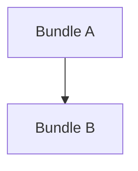

# Audit Issue Prep

Use this skill to convert audit findings into implementation-ready issues or bundle plans. Default behavior is planning and handoff only: do not edit production code unless the user explicitly asks for implementation.

## Inputs

Accept any combination of:
- Audit reports, review comments, risk registers, backlog docs, ADR follow-ups, or pasted findings.
- Repository path, target branch/commit, and project rules.
- Test restrictions, LOC limits, branch naming, commit conventions, or tool requirements.
- A desired output file path, issue tracker format, or external-agent prompt format.

If key inputs are missing, infer conservatively from the repository. Ask only when a wrong assumption would create unsafe instructions.

## Core Rules

- Separate issue preparation from implementation.
- Verify findings against the target HEAD before dispatching them.
- Mark stale findings as `RESOLVED-ALREADY`; do not create implementation work for them.
- Preserve explicit project constraints from the user or repository docs.
- Do not invent production telemetry, privileged runtime access, fixtures, owners, or product decisions.
- Group work by ownership, write set, risk, and test surface.
- Keep each issue/bundle small enough for one reviewable change. Use the user's LOC cap when provided; otherwise prefer <=300 LOC for code bundles.
- Put blocked work in `HOLD` with a concrete reopen trigger.
- External-agent prompts must assign exactly one concrete issue or bundle. Do not leave placeholders such as `<ISSUE_ID>` in a prompt that is meant to be sent to a worker.

## Workflow

1. **Read Governance**
   - Check repository instructions such as `AGENTS.md`, `CLAUDE.md`, `.memory-bank/`, or equivalent when present.
   - Capture hard constraints: forbidden tests, required tools, branch names, commit signing, and review gates.

2. **Load Source Material**
   - Read user-specified audit/backlog docs first.
   - If the user pasted findings, treat them as source material but still verify against code/docs when possible.
   - Keep the source identity in each issue: audit id, section, file line, or pasted finding number.

3. **Verify Against Target**
   - Record branch and HEAD.
   - Use fast search (`rg`) and code-intelligence tools where available.
   - For each finding, classify:
     - `OPEN`: still present and actionable.
     - `RESOLVED-ALREADY`: no longer present.
     - `NEEDS-VERIFY`: plausible but not confirmed in this environment.
     - `DECISION-GATED`: needs product/security/owner choice.
     - `HOLD`: needs telemetry, privileged runtime, production fixture, or external dependency.

4. **Challenge Findings**
   - Deduplicate overlaps.
   - Downgrade items that are theoretical, already mitigated, or outside the stated scope.
   - Promote items with clear security, data-loss, cross-tenant, DoS, or lifecycle impact.
   - Split mixed findings: doc drift, test gaps, behavior bugs, and architecture work should not be forced into one issue.

5. **Create Fix-Ready Issues**
   - Each issue should include:
     - Stable ID and short title.
     - Severity and status.
     - Evidence with file/symbol/line or doc anchor.
     - Scope and explicit non-scope.
     - Likely files touched.
     - Required impact analysis or code-intelligence checks.
     - Test plan with exact commands when known.
     - Risks and human decisions.
     - Ready-to-paste implementation prompt.
   - If preparing a prompt for an external worker, choose or preserve one assigned ID before writing the prompt. The worker should never need to ask which issue to implement.

6. **Sequence Work**
   - Order by dependency and risk.
   - Prefer structural prerequisites before behavior changes.
   - Put tests/seams before broad wiring when possible.
   - Separate frontend, backend, infra, docs, and ops-gated work unless they share one small write set.

7. **Verify the Prepared Plan**
   - Run whitespace checks when writing files: `git diff --check`.
   - If the user gave size/section constraints, verify them exactly.
   - If committing, use the repository's commit rules.

## Output Template

````markdown
## ISSUE-ID Short Title

Status: OPEN | RESOLVED-ALREADY | NEEDS-VERIFY | DECISION-GATED | HOLD
Severity: HIGH | MEDIUM | LOW
Source: audit section / finding id / pasted item
Depends on: none | ISSUE-ID
Estimated size: small | medium | large, or LOC budget

Evidence:
- `path/file.ext:line` or `SymbolName`: observed behavior.

Scope:
- Change ...
- Add/adjust tests ...

Non-scope:
- Do not ...

Files likely touched:
- `path/file.ext`: rationale.

Impact checks:
- Run `<tool or command>` for `<symbol/path>` before edits.

Test plan:
- `<command>`: expected assertion.

Risks / decisions:
- ...

Dispatch prompt:
```text
Implement ISSUE-ID on branch <branch-name>.
Repository: <repo path>.
Base: <branch or commit>.

Rules:
- Follow repository instructions.
- Do not broaden scope.
- Run required impact checks before edits.
- Run only the listed tests unless approved.
- Keep the diff within the stated size.

Goal:
...

Verification:
...

Report:
- branch
- commit SHA, if committed
- files changed
- tests run and results
- impact/blast-radius summary
- unresolved risks
```
````

## Bundle Plan Template

Use this when the user asks for a dispatch-ready backlog plan rather than individual issues.

````markdown
# Backlog Dispatch Plan

Status:
Target HEAD:
Source material:

## 1. Dependency Graph



## 2. Sequence Proposal

1. Bundle A: rationale.
2. Bundle B: rationale.

## 3. Per-Bundle Plan

## B1 Bundle Name

Branch suggestion:
Status:
Depends on:
Estimated LOC:
Source findings:
Files touched:
Test plan:
Risk callouts:
Dispatch prompt:

## 4. HOLD Items

| ID | Rationale | Reopen trigger |
|---|---|---|

## 5. Sequencing Table

| Bundle ID | Depends-on | Estimated LOC | Risk | Priority |
|---|---|---:|---|---:|
````

## External-Agent Prompt Skeleton

Use this only for generic templates. For a real worker handoff, use the concrete assigned-issue prompt below.

```text
You are a senior engineer working in <repo/project>.

Read:
- <issue or backlog plan>
- <source audit/report>
- repository instructions

Pick exactly the assigned issue/bundle. Re-verify every cited file/symbol against HEAD before editing. If already fixed, report RESOLVED-ALREADY and stop.

Rules:
- Follow project-specific tool and test restrictions.
- Use required impact analysis before editing code.
- Do not run forbidden broad tests.
- Do not use destructive git operations.
- Keep diff within the issue budget; stop and propose a split if larger.
- One branch, one reviewable change.

Deliver:
- branch
- commit SHA, if committed
- files changed
- tests run/results
- impact/blast-radius summary
- unresolved risks or follow-ups
```

## Concrete External-Agent Prompt

Use this for dispatch. Fill every placeholder before sending it to a worker. If the user has not assigned an issue, choose the highest-priority `OPEN` issue from the prepared plan and state that choice explicitly.

```text
You are a senior engineer working in <repo/project>.

Repository:
- Root: <absolute repo path>
- Base branch/commit: <target branch or commit>
- Area: <subsystem>

Assigned issue:
- <ISSUE-ID>: <exact issue title>

Do not choose another issue. Do not fix unrelated audit findings.

Goal:
<One paragraph describing the behavior to fix.>

Scope:
- <Specific allowed change 1>
- <Specific allowed change 2>
- <Specific allowed test/update>

Non-scope:
- Do not <nearby but unrelated task>.
- Do not <another common scope creep item>.

Likely files:
- `<path>`: <why>
- `<path>`: <why>

Required pre-edit checks:
- Read repository instructions.
- Record branch and HEAD.
- Re-verify every cited finding against current HEAD.
- Run required code-intelligence/impact checks before editing each symbol.
- If already fixed, report `RESOLVED-ALREADY` and stop.
- If impact is HIGH or CRITICAL, stop and report the blast radius before editing.

Implementation expectations:
- Keep the diff inside the assigned issue.
- Preserve existing behavior outside the bug being fixed.
- Make cleanup/error handling idempotent when lifecycle or resource ownership is involved.
- Keep the diff within the stated size; propose a split if larger.

Tests:
- <exact focused test command or suite>
- <expected assertion>

Forbidden:
- Do not run forbidden broad tests.
- Do not use destructive git operations.
- Do not use `--no-verify`.
- Do not overwrite unrelated dirty worktree changes.

Before commit:
- Run the repository's required change/impact detector if configured.
- Run `git diff --check`.
- Commit according to repository rules.

Branch:
- `<branch-name>`

Commit subject:
- `<scope>: <short imperative summary>`

Final report:
- Branch name
- Commit SHA, if committed
- Files changed
- Impact/blast-radius summary
- Tests run and results
- Findings fixed
- Findings found already resolved
- Remaining risks or human decisions
```
